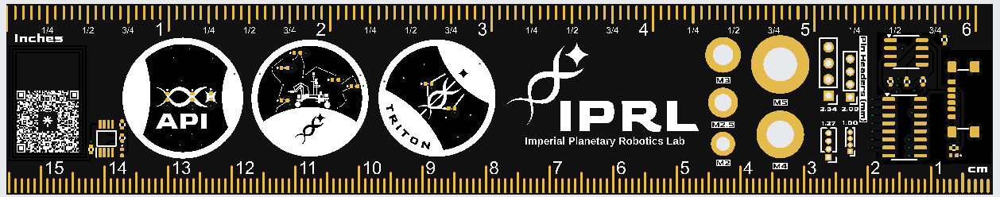
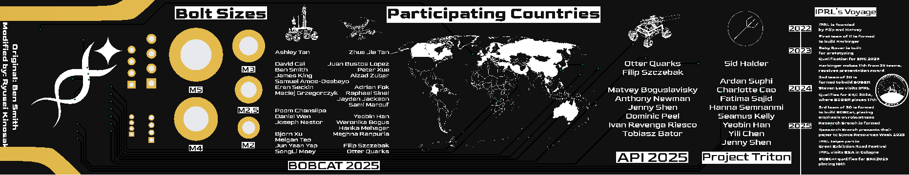

# ICRS PCB Ruler

A 15cm PCB ruler variant designed for IPRL. Forked from [here](https://github.com/ben5049/ICRS-PCB-Ruler) (with consent!) It can be easily adapted/rebranded using the KiCad project in this repository.

Front:

Back:

## KiCad Project
To open this project in KiCad 9.0 clone this repository and open the .kicad_pro file in [Ruler_KiCad](Ruler_KiCad). Next open the PCB editor and go to `Preferences > Manage Footprint Libraries > Add Existing` (the folder icon below the list of libraries). Then navigate to `Ruler_KiCad/ruler_footprints` and click "select folder". This is in order to get the custom footprints used in this project.

## Ordering
### PCB
The gerber files needed for ordering can be found in [Ruler_gerbers.zip](https://github.com/Imperial-Planetary-Robotics-Lab/IPRL_Merch_2024-25/blob/main/IPRL_2025_Ruler/PCB_RULER_IPRL_2025/PCB_RULER_IPRL_2025_GERBER.zip). Simply upload this .zip file to any PCB manufacturer's website.

The recommended specifications for ordering this PCB are as follows:
* 2 Layers
* 1.6mm thick FR4
* White silkscreen
* ENIG surface finish
* <= 1 oz Copper weight
* Tented vias
* +- 0.2mm Board outline tolerance
* Remove order number

### Stencils

The stencils are also recommended to order, make sure that customised size is chosen of 160x30. Everything else should be the default values.

## BoM

For the rest of the components on the ruler, here's the bill of materials, that can be bought in bulk in aliExpress

| Reference  | Qty | Value                         | Datasheet                                                                       |
|------------|-----|-------------------------------|---------------------------------------------------------------------------------|
| C101       | 1   | 470p 0402 Capacitor           | ~                                                                               |
| C102       | 1   | 220n 0402 Capacitor           | ~                                                                               |
| C103       | 1   | 1u 0402 Capacitor             | ~                                                                               |
| D101-D112  | 12  | 0402 SMD LED                  | ~                                                                               |
| IC101      | 1   | NT3H2211W0FTTJ                | http://www.nxp.com/docs/en/data-sheet/NT3H2111_2211.pdf                         |
| J101       | 1   | USB_C_Receptacle_PowerOnly_6P | https://www.usb.org/sites/default/files/documents/usb_type-c.zip                |
| R102       | 1   | 47k 0402 Resistor             | ~                                                                               |
| R101, R103 | 1   | 470  0402 Resistor            | ~                                                                               |
| R104,R105  | 2   | 1k  0402 Resistor             | ~                                                                               |
| U101       | 1   | NE555D Clock                  | http://www.ti.com/lit/ds/symlink/ne555.pdf                                      |
| U102       | 1   | 4017 Decade Counter           | http://www.intersil.com/content/dam/Intersil/documents/cd40/cd4017bms-22bms.pdf |

## Assembly and Setup

For the assembly and setup, here's the step-by-step instruction

1. Put solder paste using the stencil, make sure it's cleaned with IPA to avoid putting the paste somewhere else!
2. Put components on top, ensuring correct polarity for the LEDs (there's usually a dot or a marker to show that)
3. Make sure there's no short, you can start testing it by plugging in the usb C. The LED under the usb shows power input. If there's no problem, then the LED should start flicking through the symbols.
4. For the NFC, it's a little bit more complicated. First, one person needs to install the NXP tagwriter app.
5. Select Erase tags -> Erase & format as NDEF -> input 2000 bytes -> scan with phone. If you don't know where the NFC on the phone is, the LED on the NFC IC will light up if you're at the right place.
6. Now you should be able to program it with the NFC tools to your hearts content.